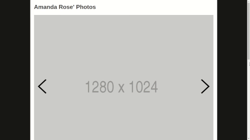

# Photo Gallery #

I built the front-end of this photo gallery app. This app was built with ES6,
HTML5, CSS3, Handlebars.js, and jQuery.

## Example Usage ##

  

## Functionality ##

- View multiple photos in gallery-style
  - If the last image is selected but the user wants to view the ‘next image,’
    the gallery will wrap around, providing a nice user experience
  - Photos have a title, date, and description
- ‘Like’ and ‘favorite’ photos
  - The ‘like’ and ‘favorite’ counts are specific to each individual photo
- Comment on photos
  - The comments are specific to each individual photo.
  - To comment, the user enters their name, email address, and comment

## Issues ##

- No form validation for comments
- You can ‘like’ and ‘favorite’ a photo multiple times without end
